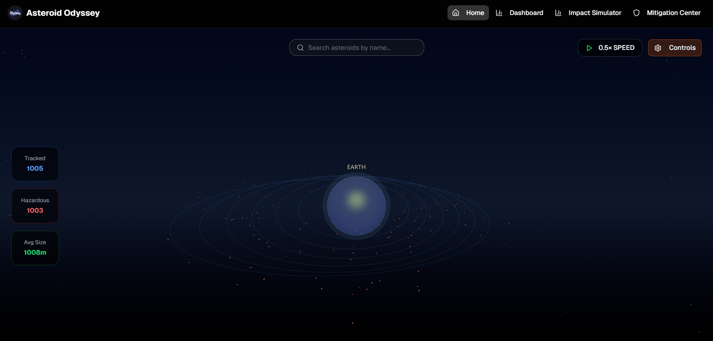
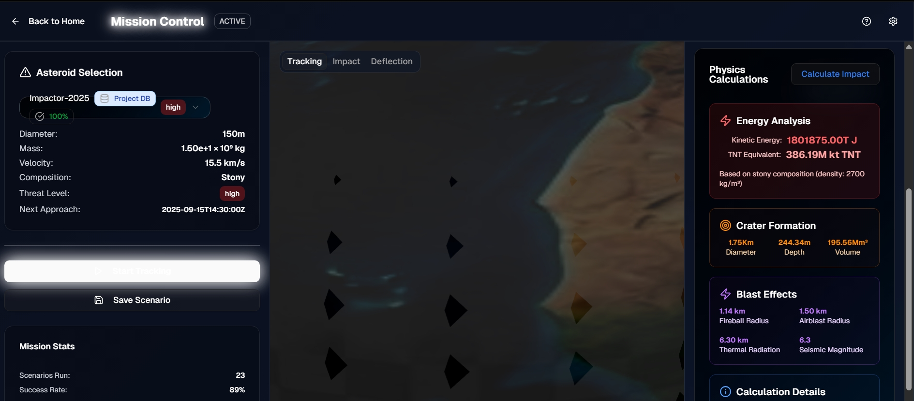
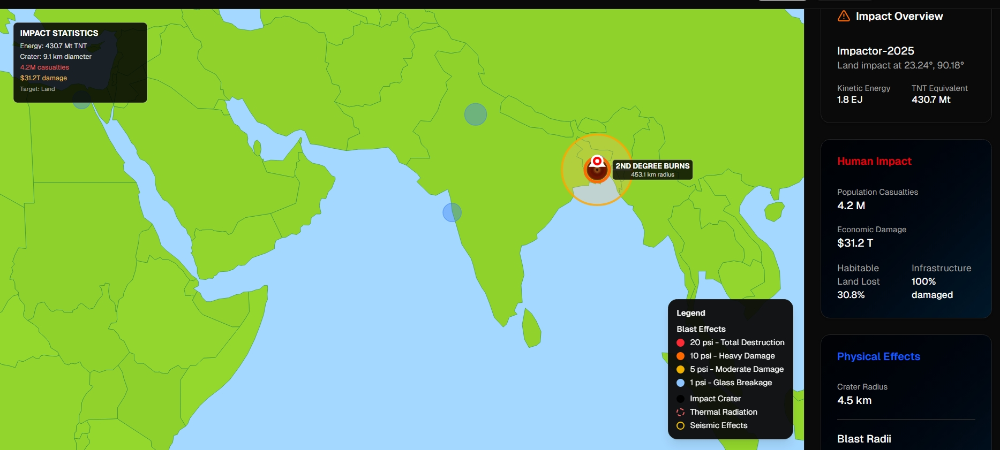
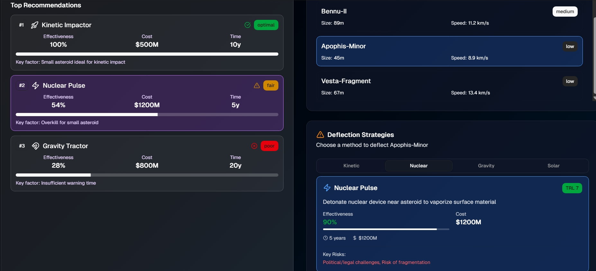
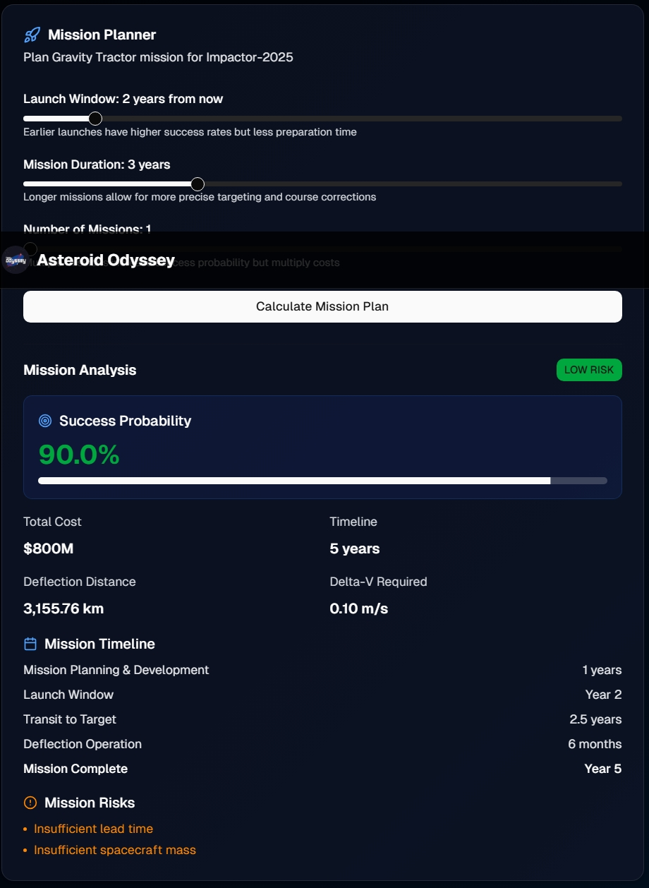
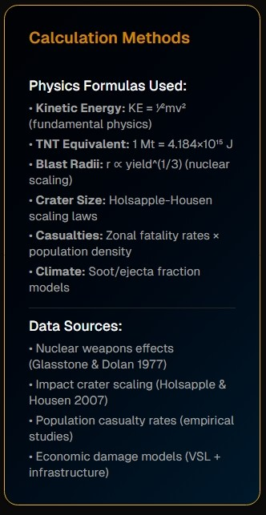

# Asteroid Odyssey

## Overview

Asteroid Odyssey is a scientifically grounded, data-driven asteroid impact simulator that visualizes global consequences over a 50-year timeline. We built this platform to help researchers, educators, and mission planners assess real-world mitigation strategies through interactive geospatial rendering and temporal effect modeling.

## About Us

We are Team Odyssey, a group of five friends each bringing unique expertise. Meet the creative minds: Md. Atik Mouhtasim, our dedicated Team Leader and lead developer.

Joining him are Md. Samir, our sharp Data & System Analyst; Mosammad Sadia Islam Prety, our creative UI/UX & graphics designer; Md. Iftiar Rafi, our talented video editor; and Kamruzzaman Khan Alvi, our active researcher.

Asteroid Odyssey uses our passion for space and planetary defense to bridge the gap between science and public awareness of the asteroid threat.

## What We Built

**Asteroid Odyssey** is an interactive asteroid impact simulation platform that transforms NASA's raw data into an engaging, educational experience. Built for the NASA Space Apps 2025 Meteor Madness challenge, it bridges the gap between complex scientific research and public awareness of planetary defense.

Our platform combines real-time NASA datasets with scientifically accurate simulations, creating a comprehensive tool for students, educators, researchers, and citizens to explore, understand, and prepare for asteroid threats.

## Screenshots

|                                     |                                     |
| ----------------------------------- | ----------------------------------- |
|  |  |
|  |  |
|  |  |

### Core Features

**🌌 Interactive Solar System Explorer**

- 3D solar system visualization with Earth at center
- 100+ real asteroids from NASA's Near-Earth Object database
- Search, filter, and explore asteroids with detailed information panels
- Clickable asteroids with orbital mechanics and threat assessment

**🎯 Advanced Impact Simulator**

- Real-time crater formation, blast wave propagation, and thermal radiation modeling
- 50-year temporal effects from immediate impact through long-term recovery
- Interactive globe with expanding damage zones and infrastructure visualization
- Comprehensive casualty estimates and climate impact analysis

**🛡️ Deflection Strategy Center**

- Compare real mitigation strategies (kinetic impactors, nuclear deflection, gravity tractors)
- 3D deflection trajectory visualization
- Success probability calculations with mission cost analysis
- Timeline planning for optimal deflection windows

**📊 Scientific Dashboard**

- Live metrics tracking casualties, climate effects, and habitability scores
- Physics-based calculations using established impact research
- Real-time data visualization with interactive controls
- Educational tooltips explaining complex concepts

---

## Platform Architecture

### Component Structure

```
/components
  /3d
    /Earth.tsx - Main 3D Earth component
    /Asteroid.tsx - Individual asteroid rendering
    /OrbitPath.tsx - Orbital trajectory visualization
    /SolarSystem.tsx - Homepage solar system model
  /dashboard
    /ControlPanel.tsx - Left panel controls
    /DataDisplay.tsx - Right panel statistics
    /StrategySelector.tsx - Deflection strategy picker
  /visualizations
    /ImpactMap.tsx - Impact zone mapping
    /DamageZones.tsx - Damage radius visualization
    /TrajectoryChart.tsx - Orbital path charts
  /impact-simulator
    /EnhancedImpactMap.tsx - D3-powered globe visualization
    /StatsOverlay.tsx - Real-time metrics overlay
```

### Data Integration

**NASA Data Sources**

- NASA JPL Small-Body Database - Real asteroid orbital elements and physical properties
- Near-Earth Object Web Service - Live asteroid tracking data
- NASA Sentry API - Impact risk assessments
- NASA Fireball API - Atmospheric entry data

**Enhanced Datasets**

- World population density and infrastructure mapping
- Climate and habitability indices
- Critical facility locations and importance ratings
- Geographic boundaries with high-resolution rendering

---

## Scientific Foundation

Our calculations implement established impact physics:

- **Crater Formation:** Holsapple & Housen (2007) scaling relations
- **Blast Effects:** 5 psi overpressure radius for structural damage
- **Thermal Radiation:** Energy-based flux calculations
- **Seismic Activity:** Magnitude scaling from impact energy
- **Climate Modeling:** Dust loading and atmospheric opacity calculations

The temporal model captures:

- **Immediate (0-24h):** Direct casualties, infrastructure destruction, crater formation
- **Medium-term (1 week - 2 years):** Climate disruption, agricultural collapse, supply chain breakdown
- **Long-term (2-50 years):** Economic recovery, ecosystem restoration, population adaptation

---

## Tech Stack

- **Frontend:** Next.js with TypeScript, Tailwind CSS, Framer Motion
- **3D Graphics:** Three.js with React Three Fiber (@react-three/fiber, @react-three/drei)
- **Data Visualization:** D3.js and Recharts
- **UI Components:** Aceternity UI & shadcn/ui components
- **State Management:** React hooks (useState, useReducer)
- **Styling:** Tailwind CSS with custom CSS variables for space theme
- **Package Manager:** pnpm
- **Deployment:** Vercel

---

## NASA Data Integration

We integrated multiple NASA data sources and research:

**APIs & Databases**

- [NASA Sentry API](https://api.nasa.gov/#Sentry) – Near-Earth Object risk assessment
- [NASA Fireball API](https://api.nasa.gov/#Fireball) – Atmospheric entry data
- [NEO Web Service](https://api.nasa.gov/neo) – Asteroid orbit and composition
- [JPL Small-Body Database](https://ssd.jpl.nasa.gov/tools/sbdb_query.html) – Physical characteristics

**Research Foundation**

- NASA EVA tool design requirements for rapid-response scenarios
- Apollo mission and Desert RATS tooling research
- Impact physics literature from NASA planetary defense studies

**Additional Data Sources**

- [Mapscaping GeoJSON](https://mapscaping.com/geojson-every-country-in-the-world/)
- [World Population Review](https://worldpopulationreview.com/country-rankings/countries-by-density)
- [Our World in Data](https://ourworldindata.org/grapher/breakdown-habitable-land)
- [NOAA Climate Data](https://www.ncei.noaa.gov/cdo-web/)

---

## Getting Started

```bash
# Install dependencies
pnpm install

# Run development server
pnpm dev

# Build for production
pnpm build

# Start production server
pnpm start
```

---

## Development Journey

We evolved from initial map prototypes with data loading issues into a production-ready simulator. Each iteration improved dataset quality, physics accuracy, and visual storytelling. The current build integrates geography, infrastructure networks, and climate systems to show how asteroid impacts cascade through interconnected global systems.

Key challenges we solved:

- Asset delivery and map rendering stability
- Real-time physics calculations without performance degradation
- Multi-layer data visualization with graceful degradation
- Cross-browser compatibility and error resilience

---

## Use Cases

**🎓 Education & Learning**

- Students learn orbital mechanics through interactive exploration
- Teachers make cosmic risks tangible with visual simulations
- Citizens discover how humanity can defend against asteroid threats
- Interactive tutorials explain complex space science concepts

**🔬 Research & Analysis**

- Compare deflection strategy effectiveness and costs
- Model regional vs. global impact scenarios
- Assess critical infrastructure vulnerability
- Analyze optimal deflection mission timing

**🚀 Mission Planning**

- Evaluate deflection mission priorities based on threat assessment
- Identify high-risk population centers for emergency planning
- Optimize resource allocation for planetary defense initiatives
- Plan international cooperation strategies

**🌍 Public Awareness**

- Bridge the gap between scientific research and public understanding
- Transform fear into curiosity and preparedness
- Build shared responsibility for planetary defense
- Engage citizens in space science and astronomy

---

## Future Vision

**🥽 Immersive Technologies**

- VR labs for immersive asteroid exploration
- AR mission control rooms for real-time collaboration
- Holographic data displays for enhanced visualization

**🌐 Global Collaboration**

- Citizen science projects refining orbital predictions
- Global collaboration hubs connecting researchers worldwide
- Real-time alert systems for asteroid threats
- Community-driven mitigation strategy development

**🤖 Advanced Features**

- AI-powered threat assessment and early warning systems
- Machine learning for improved impact predictions
- Automated deflection mission planning
- Integration with space agency mission control systems

**📚 Educational Expansion**

- Curriculum integration for schools and universities
- Professional training modules for space agencies
- Public outreach programs and planetarium shows
- Interactive workshops and citizen science initiatives

---

## License

This project was built for the NASA Space Apps Challenge. See LICENSE for details.

---

## Our Mission

> "Protecting tomorrow begins with knowledge today."

Asteroid Odyssey represents more than software — it's a bridge between science and society. We believe that by making asteroid threat data accessible and engaging, we can transform public awareness into collective action for planetary defense.

Every day, thousands of asteroids pass near our planet. Most go unnoticed, but it only takes one impact to change life on Earth forever. Our platform ensures that knowledge about these threats doesn't stay locked in research papers but reaches everyone who needs to understand and prepare.

## Acknowledgments

Built with inspiration from NASA's planetary defense research, the global space community, and our shared responsibility to protect Earth from asteroid impacts. Special thanks to NASA Space Apps Challenge for providing the platform to turn our vision into reality.

**Tags:** #AsteroidOdyssey #PlanetaryDefense #NASA #SpaceApps #AsteroidImpact #Simulation #Education #SpaceExploration #DataVisualization #NextJS #ThreeJS #D3JS
